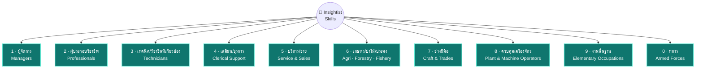

# 🧭 Insightist Skills Library

**คลัง Skills ที่คุยกับ Claude, Codex, Gemini แล้วมันเข้าใจงานคุณจริง ๆ**
ไม่ใช่แค่พร้อมพิมพ์ ใช้ได้ทันที — เขียนโดยทีม **Insightist™** แจกฟรีให้ทุกคน

> อยากเห็นภาพรวมทั้งหมดแบบลากดูได้ ลองเปิด **[🗺️ Insightist Skill Map](https://claude.ai/code/artifact/df4a05d9-4ba8-4ae8-8c89-0e2bf51677af)**
> ลากโหนด กดขยายหมวดย่อย หรือสลับไปดูตารางก็ได้ในหน้าเดียว

---

## เรื่องมันเริ่มจากตรงนี้

`SKILL.md` คือไฟล์คำสั่งเล็ก ๆ ที่ทำให้ Claude (หรือ Codex, Gemini) เก่งขึ้นในงานเฉพาะทาง
แทนที่จะอธิบายทุกครั้งว่า "ช่วยเขียน SOP หน่อย ต้องมีหัวข้อนี้ ๆ นะ" — ใส่ skill ไว้ครั้งเดียว
แล้วมันจะทำถูกทุกครั้งที่คุณต้องการ

โปรเจกต์นี้ตั้งใจทำให้ครบ **ทุกสายอาชีพ** ไม่ใช่แค่สายเทคหรือสายมาร์เก็ตติ้งที่มักมีคนทำ skill ให้อยู่แล้ว
ตอนนี้จัดหมวดตามมาตรฐานสากล **ISCO-08 (ILO)** ที่สำนักงานสถิติแห่งชาติไทยใช้เก็บข้อมูลแรงงานจริง —
ครอบคลุมครบทั้ง **10 หมวดใหญ่ / 43 หมวดย่อย** รวม **67 skills** (43 skill ใหม่ตามหมวดย่อย ISCO-08
+ 24 skill เฉพาะงานจากเวอร์ชันแรก) รายละเอียดเต็มดูที่ [`docs/TAXONOMY.md`](docs/TAXONOMY.md)

## แผนผังทั้งหมด (10 หมวดใหญ่ตาม ISCO-08)



ครบทั้ง 10 หมวดใหญ่และ 43 หมวดย่อยแล้ว (ดูตารางเต็มพร้อมจำนวนผู้มีงานทำจริงในไทยแต่ละหมวดที่
[`docs/TAXONOMY.md`](docs/TAXONOMY.md) หรือแบบลากเล่นได้จริงที่
[Skill Map](https://claude.ai/code/artifact/df4a05d9-4ba8-4ae8-8c89-0e2bf51677af))

## 67 Skills ที่ใช้ได้วันนี้ (10 หมวดใหญ่ ISCO-08)

| หมวดใหญ่ | ตัวอย่าง Skills (หมวดย่อย ISCO-08) |
|---|---|
| 1 · ผู้จัดการ (Managers) | `11-executive-strategic-memo-writer` · `12-department-management-report-builder` · `13-operations-manager-sop-and-kpi-builder` · `14-hospitality-retail-shift-and-service-planner` + 6 skill เดิม (business-model-canvas-builder ฯลฯ) |
| 2 · ผู้ประกอบวิชาชีพ (Professionals) | `21-engineering-technical-report-writer` · `22-patient-education-material-writer` · `23-lesson-and-curriculum-designer` · `24-business-analysis-memo-writer` · `25-technical-documentation-and-code-review-assistant` · `26-legal-social-cultural-brief-writer` + 18 skill เดิม (financial-ratio-analyzer ฯลฯ) |
| 3 · เทคนิค/วิชาชีพที่เกี่ยวข้อง | `31-field-technician-inspection-report-writer` · `32-clinical-support-documentation-assistant` · `33-insurance-and-brokerage-proposal-writer` · `34-paralegal-and-social-work-case-note-writer` · `35-it-support-ticket-and-troubleshooting-log-writer` |
| 4 · เสมียน/งานธุรการ | `41-office-correspondence-and-data-entry-assistant` · `42-customer-service-call-script-and-response-writer` · `43-inventory-and-accounting-clerk-report-builder` · `44-mailroom-and-records-management-assistant` |
| 5 · บริการ/ขาย | `51-hospitality-personal-service-standard-writer` · `52-retail-sales-script-and-upsell-planner` · `53-caregiving-daily-care-plan-writer` · `54-security-incident-report-writer` |
| 6 · เกษตร/ป่าไม้/ประมง | `61-crop-and-livestock-farm-plan-writer` · `62-fishery-and-forestry-operation-log-writer` · `63-subsistence-farming-household-planning-assistant` |
| 7 · ช่างฝีมือ | `71-construction-trade-job-quote-and-checklist-writer` · `72-machine-repair-service-report-writer` · `73-handicraft-and-print-shop-order-spec-writer` · `74-electrical-installation-job-checklist-writer` · `75-craft-production-batch-and-quality-log-writer` |
| 8 · ควบคุมเครื่องจักร/ประกอบชิ้นงาน | `81-plant-operator-shift-log-and-maintenance-writer` · `82-assembly-line-quality-checklist-writer` · `83-driver-trip-log-and-safety-checklist-writer` |
| 9 · งานพื้นฐาน | `91-cleaning-service-schedule-and-checklist-writer` · `92-farm-labour-daily-task-assignment-writer` · `93-labour-crew-daily-safety-briefing-writer` · `94-kitchen-prep-and-food-safety-checklist-writer` · `95-street-vendor-daily-sales-log-writer` · `96-waste-collection-route-and-log-writer` |
| 0 · ทหาร | `01-military-officer-operations-briefing-writer` · `02-nco-unit-training-schedule-writer` · `03-enlisted-personnel-daily-duty-roster-writer` |

รายการเต็มทั้ง 67 skill ดูได้ใน `catalog.json` หรือเปิด `skills/<major-group>/<skill-name>/SKILL.md` ตรง ๆ เลยก็ได้
— skill ที่มีเนื้อหาละเอียดอ่อน (การแพทย์ กฎหมาย ไฟฟ้า ความปลอดภัย) ทุกตัวมีกติกาห้ามกุข้อมูล/ตัวเลขที่ไม่แน่ใจ
ฝังอยู่ในเกณฑ์คุณภาพของตัวเองด้วย

## เอาไปใช้ยังไง (เลือกตามที่คุณใช้อยู่)

**Claude.ai (Chat / Cowork)** — เปิด `dist/<skill-name>.zip` แล้วอัปโหลดในหน้า Skills settings ได้เลย ไม่ต้องยุ่งกับโค้ด

**Claude Code / Cowork แบบทีเดียวหมด** —
```
/plugin marketplace add Thanedpol/Insightist-skill
/plugin install <skill-name>@insightist-skills
```

**OpenAI Codex** — วางโฟลเดอร์ skill ไว้ในโฟลเดอร์ skills ของ Codex ตรง ๆ หรือถ้าต่อ Codex Marketplace ไว้แล้วก็ `codex-marketplace add Thanedpol/Insightist-skill`

**Gemini CLI** — อ่าน `SKILL.md` ได้เลยเพราะเป็นมาตรฐานเดียวกัน แค่ก็อปโฟลเดอร์ไปวางใน skills directory ของ Gemini

**ขี้เกียจติดตั้ง?** เปิดไฟล์ `SKILL.md` ที่ต้องการ copy ทั้งไฟล์ไปวางเป็น custom instruction ได้เลย ทุก skill เขียนให้ self-contained อยู่แล้ว ไม่ต้องพึ่งไฟล์อื่น

## โครงสร้างในนี้มีอะไรบ้าง

```
├── README.md                    # ไฟล์นี้
├── LICENSE                      # MIT — เอาไปใช้ ต่อยอด แจกต่อได้เลย
├── catalog.json                 # index รวมทุก skill (gen อัตโนมัติ)
├── .claude-plugin/marketplace.json  # ให้ /plugin marketplace add ได้
├── docs/TAXONOMY.md             # แผนที่หมวด/อาชีพทั้งหมด รวมที่ยังไม่ได้ทำ
├── skills/<category>/<skill-name>/SKILL.md
├── dist/<skill-name>.zip        # แพ็กเกจติดตั้งพร้อมใช้ต่อ 1 skill
└── scripts/
    ├── build.py                 # gen catalog + marketplace.json + zip ใหม่ทั้งหมด
    └── validate.py              # เช็คว่า skill ใหม่เขียนถูกฟอร์แมตไหม
```

## อยากช่วยเพิ่ม Skill ใหม่?

1. เปิด skill ที่ใกล้เคียงในหมวดเดียวกันดูเป็นต้นแบบ — ทุกไฟล์มีโครงเดียวกัน (มีเมื่อไหร่ควรใช้ / ขั้นตอนทำงาน / ตัวอย่าง / เกณฑ์คุณภาพ)
2. เขียน `skills/<category>/<skill-name>/SKILL.md` ตามฟอร์แมตนั้น
3. รันเช็คให้ผ่านก่อน `python3 scripts/validate.py`
4. gen ไฟล์ประกอบใหม่ `python3 scripts/build.py` (มันจะ zip + อัปเดต catalog ให้เอง)
5. ส่ง PR มาเลย บอกด้วยว่า skill นี้ช่วยอาชีพ/งานอะไร

เช็คก่อนว่ามีในแผนหรือยังที่ [`docs/TAXONOMY.md`](docs/TAXONOMY.md) — ถ้ายังไม่มีหมวดที่ต้องการ เพิ่มเข้าไปในนั้นได้เลย

**เขียนให้ใช้ได้ทั้ง Claude/Codex/Gemini ด้วย** — ห้ามเอ่ยชื่อ tool เฉพาะ Claude (เช่น "Bash tool", "SendUserFile") ใน body ของ SKILL.md เพราะ Codex/Gemini CLI ไม่มี tool ชื่อนั้น กติกาเต็ม ๆ และเหตุผลอยู่ที่ [`docs/CROSS_PLATFORM.md`](docs/CROSS_PLATFORM.md) — `scripts/validate.py` เช็คให้อัตโนมัติอยู่แล้ว

## เครดิต

ทำและดูแลโดยทีม **Insightist™** — ปล่อยฟรีเป็น public library ให้ใครก็ใช้ได้ตาม [MIT License](LICENSE)
