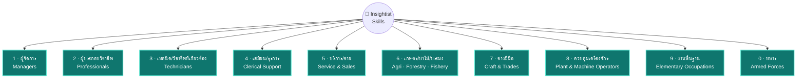

<p align="center">
  
</p>

# 🧭 Insightist Skills Library

**คลัง Skills ที่คุยกับ Claude, Codex, Gemini แล้วมันเข้าใจงานคุณจริง ๆ**
ไม่ใช่แค่พร้อมพิมพ์ ใช้ได้ทันที — เขียนโดยทีม **Insightist™** แจกฟรีให้ทุกคน

> อยากเห็นภาพรวมทั้งหมดแบบลากดูได้ ลองเปิด **[🗺️ Insightist Skill Map](https://claude.ai/code/artifact/df4a05d9-4ba8-4ae8-8c89-0e2bf51677af)**
> ลากโหนด กดขยายหมวดย่อย หรือสลับไปดูตารางก็ได้ในหน้าเดียว

---

## เรื่องมันเริ่มจากตรงนี้

`SKILL.md` คือไฟล์คำสั่งเล็ก ๆ ที่ทำให้ Claude (หรือ Codex, Gemini) เก่งขึ้นในงานเฉพาะทาง
แทนที่จะอธิบายทุกครั้งว่า "ช่วยเขียน SOP หน่อย ต้องมีหัวข้อนี้ ๆ นะ" — ใส่ skill ไว้ครั้งเดียว
แล้วมันจะทำถูกทุกครั้งที่คุณต้องการ

โปรเจกต์นี้ตั้งใจทำให้ครบ **ทุกสายอาชีพ** ไม่ใช่แค่สายเทคหรือสายมาร์เก็ตติ้งที่มักมีคนทำ skill ให้อยู่แล้ว
ตอนนี้จัดหมวดตามมาตรฐานสากล **ISCO-08 (ILO)** ที่สำนักงานสถิติแห่งชาติไทยใช้เก็บข้อมูลแรงงานจริง —
ครอบคลุมครบทั้ง **10 หมวดใหญ่ / 43 หมวดย่อย** <!-- AUTO:COUNT -->รวม **67 skills** (43 skill ตามหมวดย่อย ISCO-08 + 24 skill เฉพาะงานจากเวอร์ชันแรก)<!-- /AUTO:COUNT --> รายละเอียดเต็มดูที่ [`docs/TAXONOMY.md`](docs/TAXONOMY.md)

## แผนผังทั้งหมด (10 หมวดใหญ่ตาม ISCO-08)



ครบทั้ง 10 หมวดใหญ่และ 43 หมวดย่อยแล้ว (ดูตารางเต็มพร้อมจำนวนผู้มีงานทำจริงในไทยแต่ละหมวดที่
[`docs/TAXONOMY.md`](docs/TAXONOMY.md) หรือแบบลากเล่นได้จริงที่
[Skill Map](https://claude.ai/code/artifact/df4a05d9-4ba8-4ae8-8c89-0e2bf51677af))

<!-- AUTO:SKILLS -->
## 67 Skills ที่ใช้ได้วันนี้ (10 หมวดใหญ่ ISCO-08)

กดชื่อ skill เพื่ออ่านคำอธิบายภาษาไทย/อังกฤษของแต่ละตัว

| หมวดใหญ่ | Skills |
|---|---|
| 1 · ผู้จัดการ (Managers) · 10 skills | [`11-executive-strategic-memo-writer`](skills/managers/11-executive-strategic-memo-writer/README.md) · [`12-department-management-report-builder`](skills/managers/12-department-management-report-builder/README.md) · [`13-operations-manager-sop-and-kpi-builder`](skills/managers/13-operations-manager-sop-and-kpi-builder/README.md) · [`14-hospitality-retail-shift-and-service-planner`](skills/managers/14-hospitality-retail-shift-and-service-planner/README.md) · [`business-model-canvas-builder`](skills/managers/business-model-canvas-builder/README.md) · [`inventory-reorder-planner`](skills/managers/inventory-reorder-planner/README.md) · [`okr-goal-setter`](skills/managers/okr-goal-setter/README.md) · [`process-sop-writer`](skills/managers/process-sop-writer/README.md) · [`swot-competitive-analysis`](skills/managers/swot-competitive-analysis/README.md) · [`vendor-comparison-matrix`](skills/managers/vendor-comparison-matrix/README.md) |
| 2 · ผู้ประกอบวิชาชีพด้านต่างๆ (Professionals) · 24 skills | [`21-engineering-technical-report-writer`](skills/professionals/21-engineering-technical-report-writer/README.md) · [`22-patient-education-material-writer`](skills/professionals/22-patient-education-material-writer/README.md) · [`23-lesson-and-curriculum-designer`](skills/professionals/23-lesson-and-curriculum-designer/README.md) · [`24-business-analysis-memo-writer`](skills/professionals/24-business-analysis-memo-writer/README.md) · [`25-technical-documentation-and-code-review-assistant`](skills/professionals/25-technical-documentation-and-code-review-assistant/README.md) · [`26-legal-social-cultural-brief-writer`](skills/professionals/26-legal-social-cultural-brief-writer/README.md) · [`api-doc-writer`](skills/professionals/api-doc-writer/README.md) · [`budget-variance-report`](skills/professionals/budget-variance-report/README.md) · [`code-review-checklist`](skills/professionals/code-review-checklist/README.md) · [`contract-clause-reviewer`](skills/professionals/contract-clause-reviewer/README.md) · [`customer-persona-builder`](skills/professionals/customer-persona-builder/README.md) · [`data-cleaning-playbook`](skills/professionals/data-cleaning-playbook/README.md) · [`financial-ratio-analyzer`](skills/professionals/financial-ratio-analyzer/README.md) · [`interview-scorecard-builder`](skills/professionals/interview-scorecard-builder/README.md) · [`invoice-expense-tracker`](skills/professionals/invoice-expense-tracker/README.md) · [`job-description-writer`](skills/professionals/job-description-writer/README.md) · [`lesson-plan-builder`](skills/professionals/lesson-plan-builder/README.md) · [`nda-drafting-assistant`](skills/professionals/nda-drafting-assistant/README.md) · [`onboarding-plan-generator`](skills/professionals/onboarding-plan-generator/README.md) · [`policy-compliance-checklist`](skills/professionals/policy-compliance-checklist/README.md) · [`quiz-generator`](skills/professionals/quiz-generator/README.md) · [`sales-proposal-writer`](skills/professionals/sales-proposal-writer/README.md) · [`social-content-planner`](skills/professionals/social-content-planner/README.md) · [`training-needs-assessment`](skills/professionals/training-needs-assessment/README.md) |
| 3 · เจ้าหน้าที่เทคนิคและผู้ประกอบวิชาชีพที่เกี่ยวข้อง (Technicians and Associate Professionals) · 5 skills | [`31-field-technician-inspection-report-writer`](skills/technicians-associate-professionals/31-field-technician-inspection-report-writer/README.md) · [`32-clinical-support-documentation-assistant`](skills/technicians-associate-professionals/32-clinical-support-documentation-assistant/README.md) · [`33-insurance-and-brokerage-proposal-writer`](skills/technicians-associate-professionals/33-insurance-and-brokerage-proposal-writer/README.md) · [`34-paralegal-and-social-work-case-note-writer`](skills/technicians-associate-professionals/34-paralegal-and-social-work-case-note-writer/README.md) · [`35-it-support-ticket-and-troubleshooting-log-writer`](skills/technicians-associate-professionals/35-it-support-ticket-and-troubleshooting-log-writer/README.md) |
| 4 · เสมียน / งานธุรการสนับสนุน (Clerical Support Workers) · 4 skills | [`41-office-correspondence-and-data-entry-assistant`](skills/clerical-support-workers/41-office-correspondence-and-data-entry-assistant/README.md) · [`42-customer-service-call-script-and-response-writer`](skills/clerical-support-workers/42-customer-service-call-script-and-response-writer/README.md) · [`43-inventory-and-accounting-clerk-report-builder`](skills/clerical-support-workers/43-inventory-and-accounting-clerk-report-builder/README.md) · [`44-mailroom-and-records-management-assistant`](skills/clerical-support-workers/44-mailroom-and-records-management-assistant/README.md) |
| 5 · พนักงานบริการและผู้จำหน่ายสินค้า (Service and Sales Workers) · 4 skills | [`51-hospitality-personal-service-standard-writer`](skills/service-sales-workers/51-hospitality-personal-service-standard-writer/README.md) · [`52-retail-sales-script-and-upsell-planner`](skills/service-sales-workers/52-retail-sales-script-and-upsell-planner/README.md) · [`53-caregiving-daily-care-plan-writer`](skills/service-sales-workers/53-caregiving-daily-care-plan-writer/README.md) · [`54-security-incident-report-writer`](skills/service-sales-workers/54-security-incident-report-writer/README.md) |
| 6 · ผู้ปฏิบัติงานที่มีฝีมือด้านการเกษตร ป่าไม้ และประมง (Skilled Agricultural, Forestry and Fishery Workers) · 3 skills | [`61-crop-and-livestock-farm-plan-writer`](skills/skilled-agricultural-forestry-fishery-workers/61-crop-and-livestock-farm-plan-writer/README.md) · [`62-fishery-and-forestry-operation-log-writer`](skills/skilled-agricultural-forestry-fishery-workers/62-fishery-and-forestry-operation-log-writer/README.md) · [`63-subsistence-farming-household-planning-assistant`](skills/skilled-agricultural-forestry-fishery-workers/63-subsistence-farming-household-planning-assistant/README.md) |
| 7 · ช่างฝีมือและผู้ปฏิบัติงานที่เกี่ยวข้อง (Craft and Related Trades Workers) · 5 skills | [`71-construction-trade-job-quote-and-checklist-writer`](skills/craft-related-trades-workers/71-construction-trade-job-quote-and-checklist-writer/README.md) · [`72-machine-repair-service-report-writer`](skills/craft-related-trades-workers/72-machine-repair-service-report-writer/README.md) · [`73-handicraft-and-print-shop-order-spec-writer`](skills/craft-related-trades-workers/73-handicraft-and-print-shop-order-spec-writer/README.md) · [`74-electrical-installation-job-checklist-writer`](skills/craft-related-trades-workers/74-electrical-installation-job-checklist-writer/README.md) · [`75-craft-production-batch-and-quality-log-writer`](skills/craft-related-trades-workers/75-craft-production-batch-and-quality-log-writer/README.md) |
| 8 · ผู้ควบคุมเครื่องจักรโรงงานและผู้ประกอบชิ้นงาน (Plant and Machine Operators, and Assemblers) · 3 skills | [`81-plant-operator-shift-log-and-maintenance-writer`](skills/plant-machine-operators-assemblers/81-plant-operator-shift-log-and-maintenance-writer/README.md) · [`82-assembly-line-quality-checklist-writer`](skills/plant-machine-operators-assemblers/82-assembly-line-quality-checklist-writer/README.md) · [`83-driver-trip-log-and-safety-checklist-writer`](skills/plant-machine-operators-assemblers/83-driver-trip-log-and-safety-checklist-writer/README.md) |
| 9 · ผู้ประกอบอาชีพงานพื้นฐาน (Elementary Occupations) · 6 skills | [`91-cleaning-service-schedule-and-checklist-writer`](skills/elementary-occupations/91-cleaning-service-schedule-and-checklist-writer/README.md) · [`92-farm-labour-daily-task-assignment-writer`](skills/elementary-occupations/92-farm-labour-daily-task-assignment-writer/README.md) · [`93-labour-crew-daily-safety-briefing-writer`](skills/elementary-occupations/93-labour-crew-daily-safety-briefing-writer/README.md) · [`94-kitchen-prep-and-food-safety-checklist-writer`](skills/elementary-occupations/94-kitchen-prep-and-food-safety-checklist-writer/README.md) · [`95-street-vendor-daily-sales-log-writer`](skills/elementary-occupations/95-street-vendor-daily-sales-log-writer/README.md) · [`96-waste-collection-route-and-log-writer`](skills/elementary-occupations/96-waste-collection-route-and-log-writer/README.md) |
| 0 · ทหาร (Armed Forces Occupations) · 3 skills | [`01-military-officer-operations-briefing-writer`](skills/armed-forces-occupations/01-military-officer-operations-briefing-writer/README.md) · [`02-nco-unit-training-schedule-writer`](skills/armed-forces-occupations/02-nco-unit-training-schedule-writer/README.md) · [`03-enlisted-personnel-daily-duty-roster-writer`](skills/armed-forces-occupations/03-enlisted-personnel-daily-duty-roster-writer/README.md) |
<!-- /AUTO:SKILLS -->

รายการเต็มพร้อมคำอธิบายดูได้ใน `catalog.json` หรือเปิด `skills/<major-group>/<skill-name>/SKILL.md` ตรง ๆ เลยก็ได้
— skill ที่มีเนื้อหาละเอียดอ่อน (การแพทย์ กฎหมาย ไฟฟ้า ความปลอดภัย) ทุกตัวมีกติกาห้ามกุข้อมูล/ตัวเลขที่ไม่แน่ใจ
ฝังอยู่ในเกณฑ์คุณภาพของตัวเองด้วย

## เอาไปใช้ยังไง (เลือกตามที่คุณใช้อยู่)

**Claude.ai (Chat / Cowork)** — เปิด `dist/<skill-name>.zip` แล้วอัปโหลดในหน้า Skills settings ได้เลย ไม่ต้องยุ่งกับโค้ด

**Claude Code / Cowork แบบทีเดียวหมด** —
```
/plugin marketplace add Thanedpol/Insightist-skill
/plugin install <skill-name>@insightist-skills
```

**OpenAI Codex** — วางโฟลเดอร์ skill ไว้ในโฟลเดอร์ skills ของ Codex ตรง ๆ หรือถ้าต่อ Codex Marketplace ไว้แล้วก็ `codex-marketplace add Thanedpol/Insightist-skill`

**Gemini CLI** — อ่าน `SKILL.md` ได้เลยเพราะเป็นมาตรฐานเดียวกัน แค่ก็อปโฟลเดอร์ไปวางใน skills directory ของ Gemini

**เครื่องมืออื่น ๆ (Cursor, GitHub Copilot, VS Code, Kiro, Goose, Amp, JetBrains Junie และอีกกว่า 20 ตัว)** — ก็อปโฟลเดอร์ skill ทั้งก้อนไปวางที่ `.agents/skills/<skill-name>/` ที่ root ของโปรเจกต์ ใช้ได้ทันทีเพราะ path นี้กลายเป็นมาตรฐานพฤตินัยที่หลายเครื่องมือบรรจบกันแล้ว (ดูรายละเอียดทีละตัวที่ [`docs/TOOL_COMPATIBILITY.md`](docs/TOOL_COMPATIBILITY.md))

**ขี้เกียจติดตั้ง?** เปิดไฟล์ `SKILL.md` ที่ต้องการ copy ทั้งไฟล์ไปวางเป็น custom instruction ได้เลย ทุก skill เขียนให้ self-contained อยู่แล้ว ไม่ต้องพึ่งไฟล์อื่น

**ใช้เครื่องมืออื่นนอกจากนี้?** ตรวจสอบมาแล้วอีก 44 เครื่องมือ (Cursor, GitHub Copilot, VS Code, Kiro, Goose, Amp, JetBrains Junie ฯลฯ) ว่าตัวไหนอ่าน `SKILL.md` ได้ตรงๆ ตัวไหนต้องแปลงไฟล์ก่อน — ดูตารางเต็มที่ [`docs/TOOL_COMPATIBILITY.md`](docs/TOOL_COMPATIBILITY.md)

## โครงสร้างในนี้มีอะไรบ้าง

```
├── README.md                    # ไฟล์นี้
├── LICENSE                      # MIT — เอาไปใช้ ต่อยอด แจกต่อได้เลย
├── AGENTS.md                    # สารบัญ skill สำหรับ agent ที่อ่าน AGENTS.md (gen อัตโนมัติ)
├── catalog.json                 # index รวมทุก skill (gen อัตโนมัติ)
├── .claude-plugin/marketplace.json  # ให้ /plugin marketplace add ได้
├── docs/TAXONOMY.md             # แผนที่หมวด/อาชีพทั้งหมดตาม ISCO-08 (10 หมวดใหญ่ / 43 หมวดย่อย)
├── docs/CROSS_PLATFORM.md       # กติกาเขียน SKILL.md ให้ข้ามแพลตฟอร์มได้ (Claude/Codex/Gemini)
├── docs/TOOL_COMPATIBILITY.md   # ผลตรวจสอบความเข้ากันได้กับอีก 44 เครื่องมือ AI agent
├── skills/<category>/<skill-name>/SKILL.md   # ตัว skill
├── skills/<category>/<skill-name>/README.md  # คำอธิบายไทย/อังกฤษของแต่ละ skill
├── dist/<skill-name>.zip        # แพ็กเกจติดตั้งพร้อมใช้ต่อ 1 skill
└── scripts/
    ├── build.py                 # gen catalog + marketplace.json + AGENTS.md + ตาราง skill ใน README + zip
    ├── install.py               # ก๊อป skill ไปวางแบบชั้นเดียวในโฟลเดอร์ที่เครื่องมือ AI อ่าน
    └── validate.py              # เช็คว่า SKILL.md และ README.md เขียนถูกฟอร์แมตไหม
.github/workflows/build.yml      # push ขึ้น master แล้ว GitHub จะ validate + build + commit ไฟล์ที่ gen ให้เอง
```

## อยากช่วยเพิ่ม Skill ใหม่?

1. เปิด skill ที่ใกล้เคียงในหมวดเดียวกันดูเป็นต้นแบบ — ทุกไฟล์มีโครงเดียวกัน (มีเมื่อไหร่ควรใช้ / ขั้นตอนทำงาน / ตัวอย่าง / เกณฑ์คุณภาพ)
2. เขียน `skills/<category>/<skill-name>/SKILL.md` ตามฟอร์แมตนั้น
3. รันเช็คให้ผ่านก่อน `python3 scripts/validate.py`
4. เขียน `README.md` คู่กันในโฟลเดอร์เดียวกัน (ไทย + อังกฤษ ใช้ skill ที่มีอยู่เป็นแบบ) แล้วรัน `python3 scripts/build.py`
   ถ้าลืมรัน ไม่เป็นไร พอ push ขึ้น `master` แล้ว GitHub Actions จะ gen `catalog.json`, `AGENTS.md`, ตาราง skill ใน README และ zip ให้อัตโนมัติ
5. ส่ง PR มาเลย บอกด้วยว่า skill นี้ช่วยอาชีพ/งานอะไร

เช็คก่อนว่ามีในแผนหรือยังที่ [`docs/TAXONOMY.md`](docs/TAXONOMY.md) — ถ้ายังไม่มีหมวดที่ต้องการ เพิ่มเข้าไปในนั้นได้เลย

**เขียนให้ใช้ได้ทั้ง Claude/Codex/Gemini ด้วย** — ห้ามเอ่ยชื่อ tool เฉพาะ Claude (เช่น "Bash tool", "SendUserFile") ใน body ของ SKILL.md เพราะ Codex/Gemini CLI ไม่มี tool ชื่อนั้น กติกาเต็ม ๆ และเหตุผลอยู่ที่ [`docs/CROSS_PLATFORM.md`](docs/CROSS_PLATFORM.md) — `scripts/validate.py` เช็คให้อัตโนมัติอยู่แล้ว

## เครดิต

ทำและดูแลโดยทีม **Insightist™** — ปล่อยฟรีเป็น public library ให้ใครก็ใช้ได้ตาม [MIT License](LICENSE)
