# 🧭 Insightist Skills Library

**คลัง Skills ที่คุยกับ Claude, Codex, Gemini แล้วมันเข้าใจงานคุณจริง ๆ**
ไม่ใช่แค่พร้อมพิมพ์ ใช้ได้ทันที — เขียนโดยทีม **Insightist™** แจกฟรีให้ทุกคน

> อยากเห็นภาพรวมทั้งหมดแบบลากดูได้ ลองเปิด **[🗺️ Insightist Skill Map](https://claude.ai/code/artifact/df4a05d9-4ba8-4ae8-8c89-0e2bf51677af)**
> ลากโหนด กดขยายหมวดย่อย หรือสลับไปดูตารางก็ได้ในหน้าเดียว

---

## เรื่องมันเริ่มจากตรงนี้

`SKILL.md` คือไฟล์คำสั่งเล็ก ๆ ที่ทำให้ Claude (หรือ Codex, Gemini) เก่งขึ้นในงานเฉพาะทาง
แทนที่จะอธิบายทุกครั้งว่า "ช่วยเขียน SOP หน่อย ต้องมีหัวข้อนี้ ๆ นะ" — ใส่ skill ไว้ครั้งเดียว
แล้วมันจะทำถูกทุกครั้งที่คุณต้องการ

โปรเจกต์นี้ตั้งใจทำให้ครบ **ทุกสายอาชีพ** ไม่ใช่แค่สายเทคหรือสายมาร์เก็ตติ้งที่มักมีคนทำ skill ให้อยู่แล้ว
ตอนนี้อยู่ในเฟส **วางโครง + ทำตัวอย่างจริง (Pilot)**: มี 24 skills ใช้งานได้จริงใน 8 หมวด
และวางแผนไว้แล้วอีก 10 หมวดสำหรับขยายต่อ (ดูแผนที่เต็มด้านล่าง)

## แผนผังทั้งหมด (หมวดไหนทำแล้ว หมวดไหนกำลังจะมา)

```mermaid
flowchart TB
    HUB((🧭 Insightist<br/>Skills))
    HUB --> C1[💼 กลยุทธ์ธุรกิจ]
    HUB --> C2[💰 การเงิน/บัญชี]
    HUB --> C3[📢 การตลาด/งานขาย]
    HUB --> C4[👥 งานบุคคล/HR]
    HUB --> C5[⚖️ กฎหมาย/Compliance]
    HUB --> C6[💻 เทคโนโลยี/ข้อมูล]
    HUB --> C7[🏭 ปฏิบัติการ/โลจิสติกส์]
    HUB --> C8[🎓 การศึกษา/ฝึกอบรม]
    HUB -.-> P1[🏥 สุขภาพ]
    HUB -.-> P2[🏗️ วิศวกรรม/การผลิต]
    HUB -.-> P3[🎨 ครีเอทีฟ/ออกแบบ]
    HUB -.-> P4[🌾 เกษตร/อาหาร]
    HUB -.-> P5[🏘️ อสังหาฯ/ก่อสร้าง]
    HUB -.-> P6[🛎️ บริการลูกค้า/ท่องเที่ยว]
    HUB -.-> P7[🏛️ รัฐ/NGO]
    HUB -.-> P8[🔬 วิทยาศาสตร์/วิจัย]
    HUB -.-> P9[🚚 ขนส่ง/โลจิสติกส์เฉพาะทาง]
    HUB -.-> P10[🔧 งานฝีมือ/ช่างเทคนิค]

    classDef done fill:#0f766e,stroke:#5eead4,color:#fff,stroke-width:2px;
    classDef planned fill:#78350f,stroke:#f6ad55,color:#fff,stroke-width:1px,stroke-dasharray: 4 3;
    class C1,C2,C3,C4,C5,C6,C7,C8 done;
    class P1,P2,P3,P4,P5,P6,P7,P8,P9,P10 planned;
```



เส้นทึบ = สร้างเสร็จ ใช้ได้เลย · เส้นประ = อยู่ในแผนขยาย (ดูรายละเอียดหมวดย่อยทั้งหมดที่ [`docs/TAXONOMY.md`](docs/TAXONOMY.md)
หรือแบบลากเล่นได้จริงที่ [Skill Map](https://claude.ai/code/artifact/df4a05d9-4ba8-4ae8-8c89-0e2bf51677af))

## 24 Skills ที่ใช้ได้วันนี้

| หมวด | Skills |
|---|---|
| 💼 กลยุทธ์ธุรกิจ | `business-model-canvas-builder` · `swot-competitive-analysis` · `okr-goal-setter` |
| 💰 การเงิน/บัญชี | `financial-ratio-analyzer` · `budget-variance-report` · `invoice-expense-tracker` |
| 📢 การตลาด/งานขาย | `sales-proposal-writer` · `customer-persona-builder` · `social-content-planner` |
| 👥 งานบุคคล/HR | `job-description-writer` · `interview-scorecard-builder` · `onboarding-plan-generator` |
| ⚖️ กฎหมาย/Compliance | `contract-clause-reviewer` · `nda-drafting-assistant` · `policy-compliance-checklist` |
| 💻 เทคโนโลยี/ข้อมูล | `code-review-checklist` · `data-cleaning-playbook` · `api-doc-writer` |
| 🏭 ปฏิบัติการ/โลจิสติกส์ | `inventory-reorder-planner` · `process-sop-writer` · `vendor-comparison-matrix` |
| 🎓 การศึกษา/ฝึกอบรม | `lesson-plan-builder` · `training-needs-assessment` · `quiz-generator` |

รายละเอียดแบบเจาะลึกทีละไฟล์ดูได้ใน `catalog.json` หรือเปิด `skills/<category>/<skill-name>/SKILL.md` ตรง ๆ เลยก็ได้

## เอาไปใช้ยังไง (เลือกตามที่คุณใช้อยู่)

**Claude.ai (Chat / Cowork)** — เปิด `dist/<skill-name>.zip` แล้วอัปโหลดในหน้า Skills settings ได้เลย ไม่ต้องยุ่งกับโค้ด

**Claude Code / Cowork แบบทีเดียวหมด** —
```
/plugin marketplace add Thanedpol/Insightist-skill
/plugin install <skill-name>@insightist-skills
```

**OpenAI Codex** — วางโฟลเดอร์ skill ไว้ในโฟลเดอร์ skills ของ Codex ตรง ๆ หรือถ้าต่อ Codex Marketplace ไว้แล้วก็ `codex-marketplace add Thanedpol/Insightist-skill`

**Gemini CLI** — อ่าน `SKILL.md` ได้เลยเพราะเป็นมาตรฐานเดียวกัน แค่ก็อปโฟลเดอร์ไปวางใน skills directory ของ Gemini

**ขี้เกียจติดตั้ง?** เปิดไฟล์ `SKILL.md` ที่ต้องการ copy ทั้งไฟล์ไปวางเป็น custom instruction ได้เลย ทุก skill เขียนให้ self-contained อยู่แล้ว ไม่ต้องพึ่งไฟล์อื่น

## โครงสร้างในนี้มีอะไรบ้าง

```
├── README.md                    # ไฟล์นี้
├── LICENSE                      # MIT — เอาไปใช้ ต่อยอด แจกต่อได้เลย
├── catalog.json                 # index รวมทุก skill (gen อัตโนมัติ)
├── .claude-plugin/marketplace.json  # ให้ /plugin marketplace add ได้
├── docs/TAXONOMY.md             # แผนที่หมวด/อาชีพทั้งหมด รวมที่ยังไม่ได้ทำ
├── skills/<category>/<skill-name>/SKILL.md
├── dist/<skill-name>.zip        # แพ็กเกจติดตั้งพร้อมใช้ต่อ 1 skill
└── scripts/
    ├── build.py                 # gen catalog + marketplace.json + zip ใหม่ทั้งหมด
    └── validate.py              # เช็คว่า skill ใหม่เขียนถูกฟอร์แมตไหม
```

## อยากช่วยเพิ่ม Skill ใหม่?

1. เปิด skill ที่ใกล้เคียงในหมวดเดียวกันดูเป็นต้นแบบ — ทุกไฟล์มีโครงเดียวกัน (มีเมื่อไหร่ควรใช้ / ขั้นตอนทำงาน / ตัวอย่าง / เกณฑ์คุณภาพ)
2. เขียน `skills/<category>/<skill-name>/SKILL.md` ตามฟอร์แมตนั้น
3. รันเช็คให้ผ่านก่อน `python3 scripts/validate.py`
4. gen ไฟล์ประกอบใหม่ `python3 scripts/build.py` (มันจะ zip + อัปเดต catalog ให้เอง)
5. ส่ง PR มาเลย บอกด้วยว่า skill นี้ช่วยอาชีพ/งานอะไร

เช็คก่อนว่ามีในแผนหรือยังที่ [`docs/TAXONOMY.md`](docs/TAXONOMY.md) — ถ้ายังไม่มีหมวดที่ต้องการ เพิ่มเข้าไปในนั้นได้เลย

## เครดิต

ทำและดูแลโดยทีม **Insightist™** — ปล่อยฟรีเป็น public library ให้ใครก็ใช้ได้ตาม [MIT License](LICENSE)
